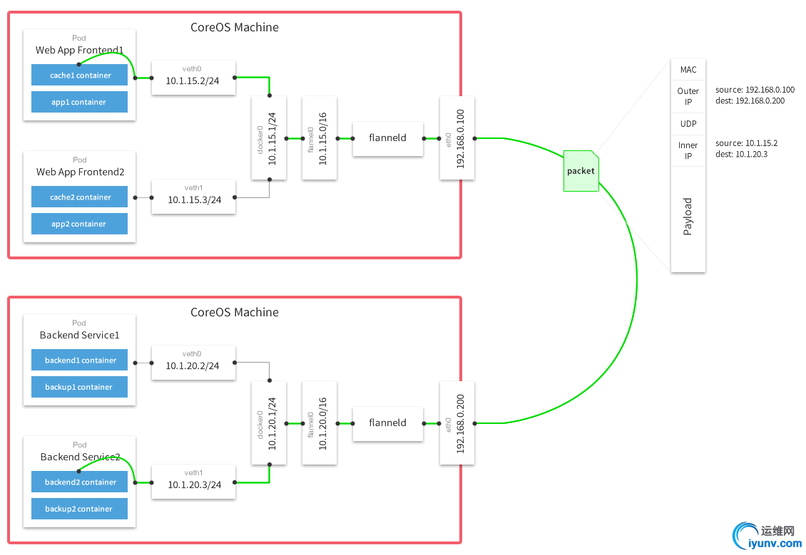

0.flannel网络架构图
    
```
Flannel是CoreOS团队针对Kubernetes设计的一个网络规划服务，简单来说，它的功能是让集群中的不同节点主机创建的
Docker容器都具有全集群唯一的虚拟IP地址。但在默认的Docker配置中，每个节点上的Docker服务会分别负责所在节点容
器的IP分配。这样导致的一个问题是，不同节点上容器可能获得相同的内外IP地址。并使这些容器之间能够之间通过IP地址相
互找到，也就是相互ping通。
 
Flannel的设计目的就是为集群中的所有节点重新规划IP地址的使用规则，从而使得不同节点上的容器能够获得"同属一个内
网"且"不重复的"IP地址，并让属于不同节点上的容器能够直接通过内网IP通信。
 
Flannel实质上是一种"覆盖网络(overlay network)"，即表示运行在一个网上的网（应用层网络），并不依靠ip地址来传递消息
，而是采用一种映射机制，把ip地址和identifiers做映射来资源定位。也就是将TCP数据包装在另一种网络包里面进行路由转发和
通信，目前已经支持UDP、VxLAN、AWS VPC和GCE路由等数据转发方式。
 
原理是每个主机配置一个ip段和子网个数。例如，可以配置一个覆盖网络使用 10.100.0.0/16段，每个主机/24个子网。因此主机a
可以接受10.100.5.0/24，主机B可以接受10.100.18.0/24的包。flannel使用etcd来维护分配的子网到实际的ip地址之间的映射。
对于数据路径，flannel 使用udp来封装ip数据报，转发到远程主机。选择UDP作为转发协议是因为他能穿透防火墙。
例如，AWS Classic无法转发IPoIP or GRE 网络包，是因为它的安全组仅仅支持TCP/UDP/ICMP。
flannel 使用etcd存储配置数据和子网分配信息。flannel 启动之后，后台进程首先检索配置和正在使用的子网列表，然后选择一个
可用的子网，然后尝试去注册它。etcd也存储这个每个主机对应的ip。flannel 使用etcd的watch机制监视
/coreos.com/network/subnets下面所有元素的变化信息，并且根据他来维护一个路由表。为了提高性能，
flannel优化了Universal TAP/TUN设备，对TUN和UDP之间的ip分片做了代理。
```


1.安装
    yum install -y flannel
2.配置etcd
    
    etcdctl rm -r /flannel/network
    etcdctl mk /flannel/network/config '{"Network":"172.17.0.0/16", "SubnetMin": "172.17.1.0", "SubnetMax": "172.17.254.0"}'

3.配置flannel
    命令
        vim /etc/sysconfig/flanneld
    内容
        FLANNEL_ETCD_ENDPOINTS="http://10.100.134.3:2379"
        FLANNEL_ETCD_PREFIX="/flannel/network"
        FLANNEL_OPTIONS="--logtostderr=false --log_dir=/var/log/k8s/flannel/ --etcd-endpoints=http://10.100.134.3:2379 --iface=eno16777736"
    
    分发
        scp /etc/sysconfig/flanneld bigdata04:/etc/sysconfig/flanneld
        scp /etc/sysconfig/flanneld bigdata05:/etc/sysconfig/flanneld

4.启动flannel
    systemctl start flanneld
    systemctl enable flanneld

    systemctl restart flanneld
    systemctl status flanneld

    查看分配的地址段
    etcdctl ls /flannel/network/subnets

5.刷新docker启动环境变量
    source /run/flannel/subnet.env
    ifconfig docker0 ${FLANNEL_SUBNET}

6.确认docker0属于flannel0子网
    ip addr

7.重启docker 
    systemctl restart docker
    systemctl status docker

8.ping通docker0
    在各个主机上能ping通其他节点的docker0网桥
9.夸主机的container之间测试：
    host1
        docker run -it   centos   /bin/bash
        查看容器ip
        hostname -i
    host2
        docker run -it   centos   /bin/bash
        查看容器ip
        hostname -i
    host1和host2的容器IP能够ping通

10.注意事项
   如果以前安装过flannel，将会生成诸如flannel.0，flannel.1
   值类的网络设备，需要删除后再重启网卡
    ip link delete flannel.0
    systemctl  restart  network

11.docker
    错误如下
    WARNING: IPv4 forwarding is disabled. Networking will not work.
    解决方案：
        vim /usr/lib/sysctl.d/00-system.conf
        添加内容
        net.ipv4.ip_forward=1
    重启网络
         systemctl  restart  network
    重启docker
         systemctl restart docker

13.常用iptables命令
    iptables -nL --line-number
    iptables -L
    iptables -F
    iptables -X
    iptables -Z