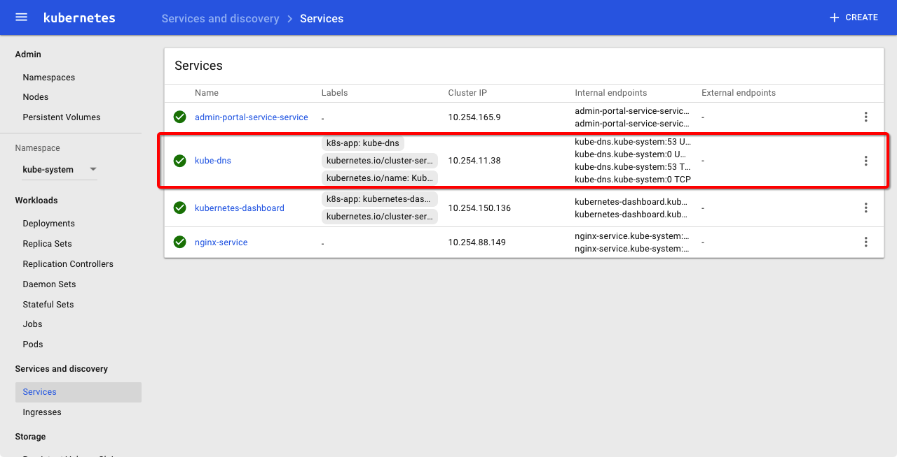
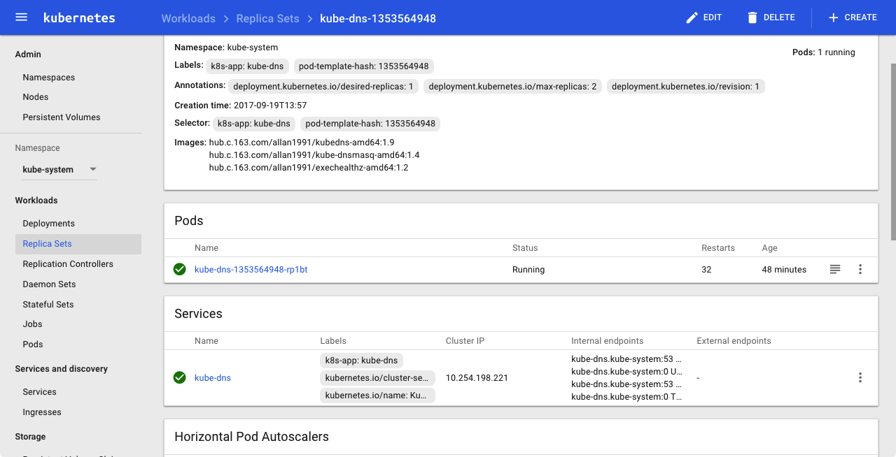
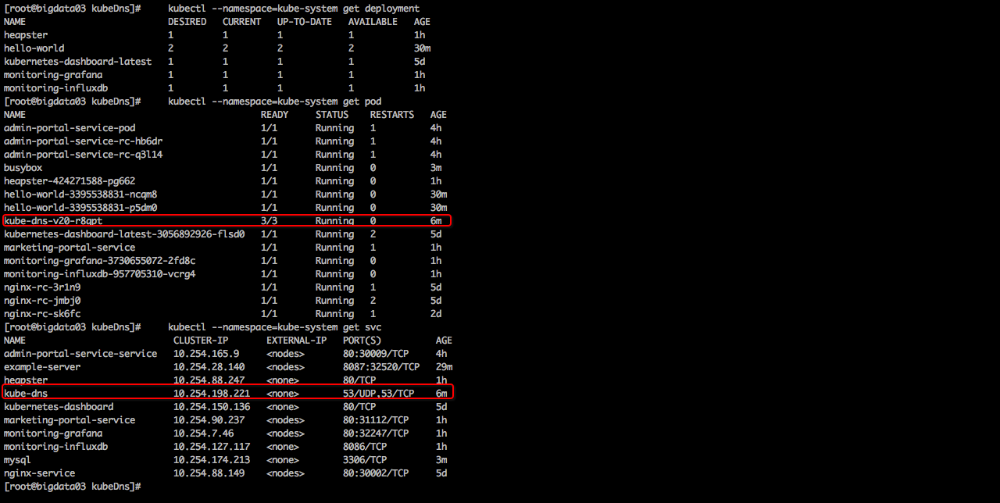
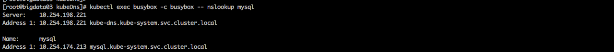

http://time-track.cn/deploy-kubernetes-step-by-step-on-trusty-section-3.html
http://www.cnblogs.com/zhenyuyaodidiao/p/6646438.html

一、部署kube-dns（不成功）
创建服务：
    kubectl create -f kubedns-deployment.yaml
    kubectl create -f kubedns-svc.yaml

删除服务：
    kubectl delete -f kubedns-deployment.yaml
    kubectl delete -f kubedns-svc.yaml

查看服务
    kubectl --namespace=kube-system get deployment
    kubectl --namespace=kube-system get pod
    kubectl --namespace=kube-system get svc


查看服务
http://10.100.134.3:8080/api/v1/proxy/namespaces/kube-system/services/kubernetes-dashboard/#/service?namespace=kube-system

kubectl get pods --namespace=kube-system -l k8s-app=kube-dns






一、部署kube-dns（成功）
```
创建服务：
    kubectl create -f kube-dns-rc_14.yaml 
    kubectl create -f kube-dns-svc_14.yaml

删除服务：
    kubectl delete -f kube-dns-rc_14.yaml 
    kubectl delete -f kube-dns-svc_14.yaml
查看服务
    kubectl --namespace=kube-system get deployment
    kubectl --namespace=kube-system get pod
    kubectl --namespace=kube-system get svc
```
 

    
    
   
二、配置kubelet（成功）
```
http://www.cnblogs.com/zhenyuyaodidiao/p/6646438.html
配置kubelet
    配置命令
       vim /etc/kubernetes/kubelet 
    添加内容
      KUBELET_ARGS="--cluster-dns=10.254.198.221 --cluster-domain=cluster.local. --allow-privileged=true"
配置apiserver 
    配置命令
        vim /etc/kubernetes/apiserver 
    修改内容
        修改前
         KUBE_ADMISSION_CONTROL="--admission-control=NamespaceLifecycle,NamespaceExists,LimitRanger,SecurityContextDeny,ServiceAccount,ResourceQuota"
        修改后
         KUBE_ADMISSION_CONTROL="--admission-control=NamespaceLifecycle,NamespaceExists,LimitRanger,SecurityContextDeny,ResourceQuota"
    分发文件
        scp /etc/kubernetes/apiserver  bigdata04:/etc/kubernetes/
        scp /etc/kubernetes/apiserver  bigdata05:/etc/kubernetes/

重启slave
    systemctl stop  kubelet.service  kube-proxy.service
    systemctl start  kubelet.service  kube-proxy.service

重启动docker
    systemctl restart docker

```
   
三、验证配置是否成功
创建一个Pod，里面运行一个busybox容器，主要是为了使用里面的nslookup命令：
参考文件：
    * [busybox.yaml](yml/busybox.yaml)
    * [mysql.yaml](yml/mysql.yaml)

删除服务：
    kubectl delete -f busybox.yaml
    kubectl delete -f mysql.yaml
创建服务：
    kubectl create -f busybox.yaml
    kubectl create -f mysql.yaml
测试服务
    先创建的busybox里面通过DNS查询后创建的mysql服务，看是否可以查到：
    kubectl exec busybox -c busybox -- nslookup mysql
    
    
    


