http://www.jianshu.com/p/d078d353d12f

1.运行容器

docker rm influxsrv
docker run -d \
   -p 8083:8083 \
   -p 8086:8086 \
   --expose 8090 \
   --expose 8099 \
   --name influxsrv \
   tutum/influxdb
2.检查部署成功与否
    http://10.100.134.3:8083/
    
    通过Web浏览器访问http://docker-host-ip:8083访问influxdb后台管理，
    并登录后台管理系统(默认用户名：root, 默认密码：root)。
    
   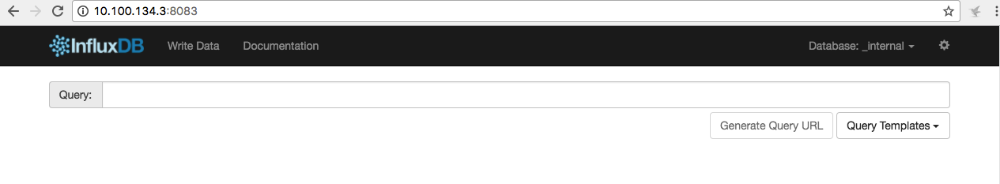

3. 创建cAdvisor应用数据库

在登录influxdb后台数据库管理平台后， 创建cAdvisor数据库，
 用于存储cAdvisor应用所获取的实时监控数据。在influxDB管理界面中的Querie s输入框中创建数据库和用户：   
    # 创建数据库
    create database 'cadvisor'; 
    # 创建用户 
    CREATE USER "cadvisor" WITH PASSWORD 'cadvisor'
    # 用户授权
    grant all privileges on cadvisor to "cadvisor"
    # 授予读写权限
    grant WRITE on cadvisor to "cadvisor"
    grant READ on cadvisor to "cadvisor"

4. 运行cAdvisor应用容器并与influxDB容器进行互联
    启动cAdvisor容器
    docker rm cadvisor
    docker run  --volume=/:/rootfs:ro  --volume=/var/run:/var/run:rw  --volume=/sys:/sys:ro   --volume=/var/lib/docker/:/var/lib/docker:ro  -p 8084:8080  --detach=true --link influxsrv:influxsrv --name=cadvisor  google/cadvisor:latest  -storage_driver=influxdb  -storage_driver_db=cadvisor  -storage_driver_host=influxsrv:8086
    
    cAdvisor应用容器启动成功后，通过Web浏览器访问地址
    http://10.100.134.3:8084/containers/
    便可以查看cAdvisor监控工具所收集到的Docker主机和容器的资源统计信息。
       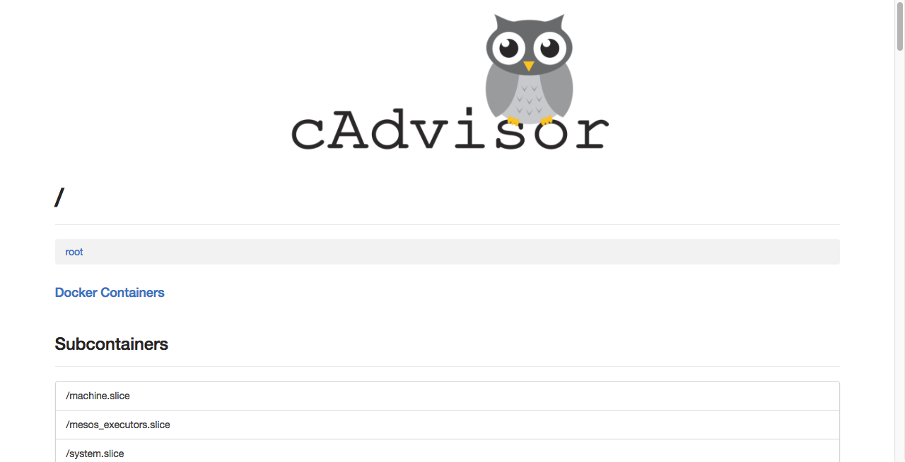
       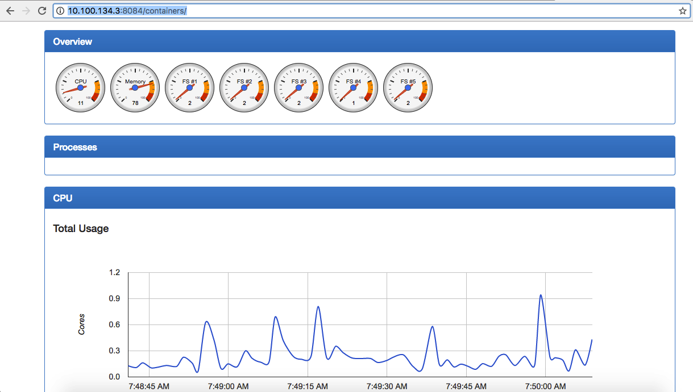
       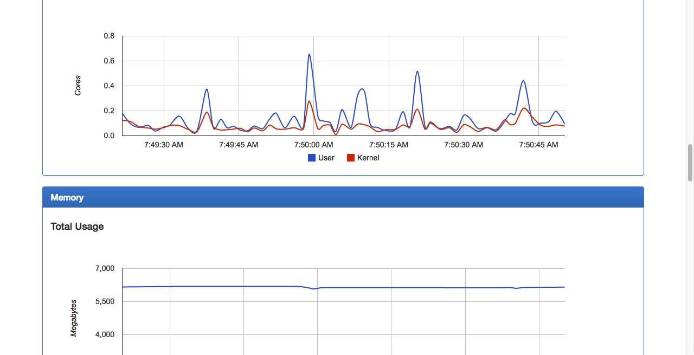


5. 运行Grafana可视化平台并与influxDB容器进行互联
    docker rm  grafana
    docker run -d -p 3000:3000  -e INFLUXDB_HOST=localhost -e INFLUXDB_PORT=8086 -e INFLUXDB_NAME=cadvisor -e INFLUXDB_USER=root  -e INFLUXDB_PASS=root  --link influxsrv:influxsrv  --name grafana  grafana/grafana
6. 登录Grafana管理平台
    通过Web浏览器访问地址http://docker-host-ip:3000登录Grafana管理平台。
    用户名：admin
    密 码：admin
    
    http://10.100.134.3:3000/login

   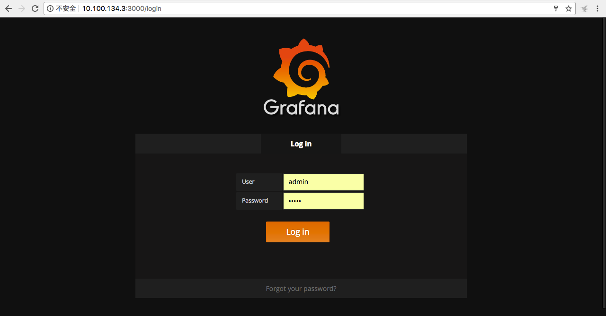  
   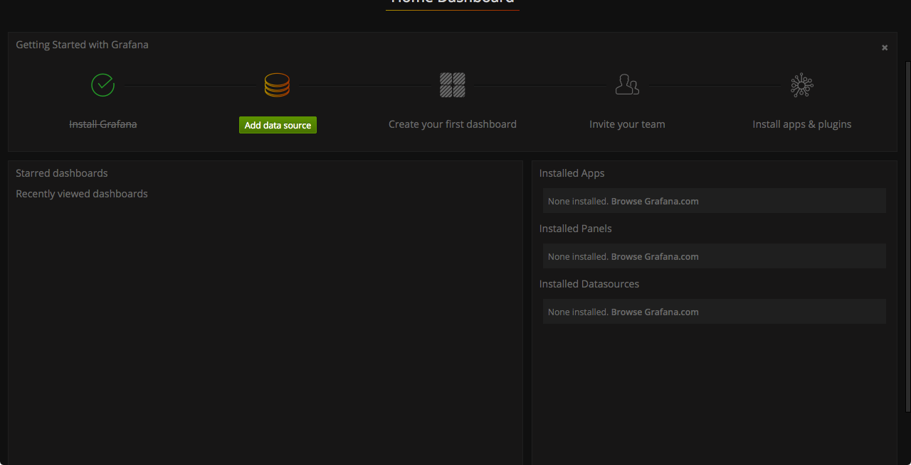


7. 配置Grafana与influxDB数据库连接

(1). 配置Granfana数据源
在Grafana管理平台中，单击“添加数据源”对数据源进行配置。如下图所示。
   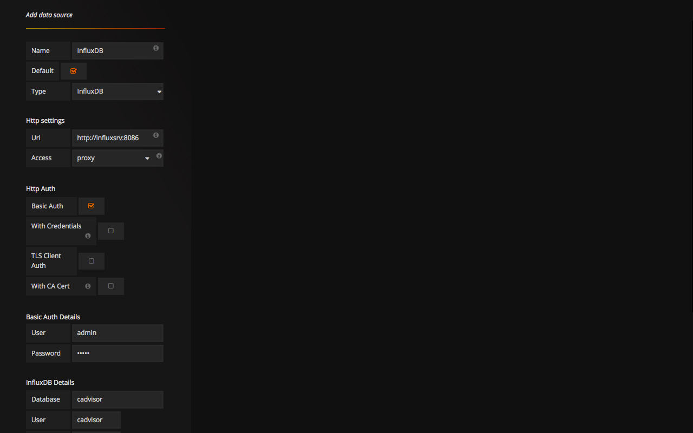
 ```
 基本信息
 Name：influxdb
 Type：influxDB
 Default: checked
 
 Http settings
 Url：http://influxsrv:8086
 Access：proxy
 
 HTTP Auth
 Basic Auth: checked
 
 Basic Auth Details
 User: admin
 Password: admin
 
 InfluxDB Details
 Database：cadvisor
 User：cadvisor
 Password：cadvisor
 
 配置完成后， 我们已经建立与influxDB的连接，下面我们将其进行测试。

```  
(2). 添加Dashboard

下面我们将使用Grafana配置我们的第一个Dashboard，并可视化来自cAdvisor的监控数据。

1). 点击“Grafana”图标, 打开Dashboard菜单，选择新建Dashboard；

   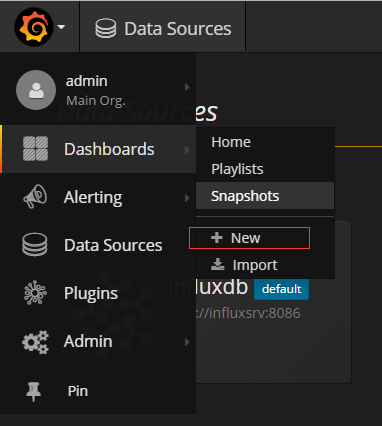

2). 在Dashboard面板中选择相应的组件并拖动到相关的位置；
   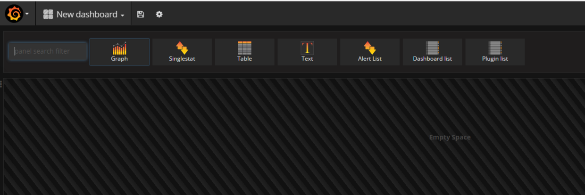

3). 点击面板的标题，会弹出相应的选项"view"、"edit"、"Duplicates"、"share"和删除按扭；

   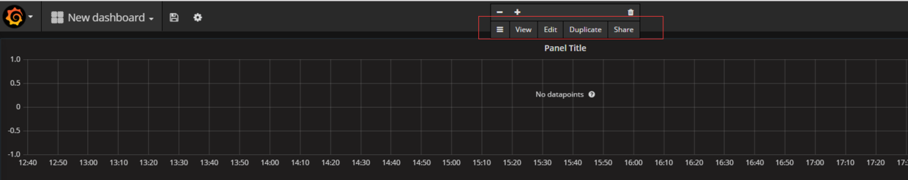

4). 选择"edit"选项，出现相应的配置项，在“Metrics”选项卡中配置相应的数据表和数据源信息；

   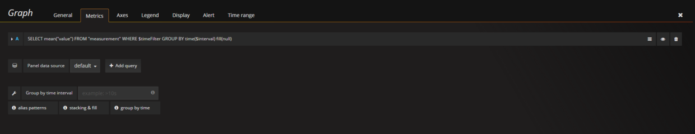

    例如： 配置内存使用率信息
   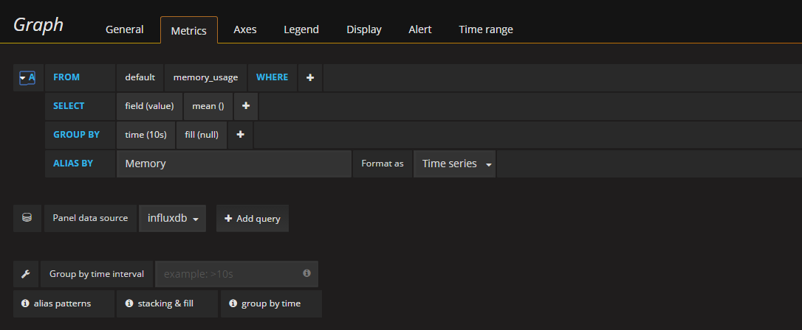

    在Metric选项卡中， 配置数据表来源为：SELECT mean("value") FROM "memory_usage" WHERE $timeFilter GROUP BY time(10s) fill(0)， 配置数据源Panel Datasource为：cadvisor；
    在Axes选项卡中配置相关的显示单位。
5). 配置完相关的选项后，点击Dashboard导航栏的保存按钮，便可完成Dashboard的配置。
   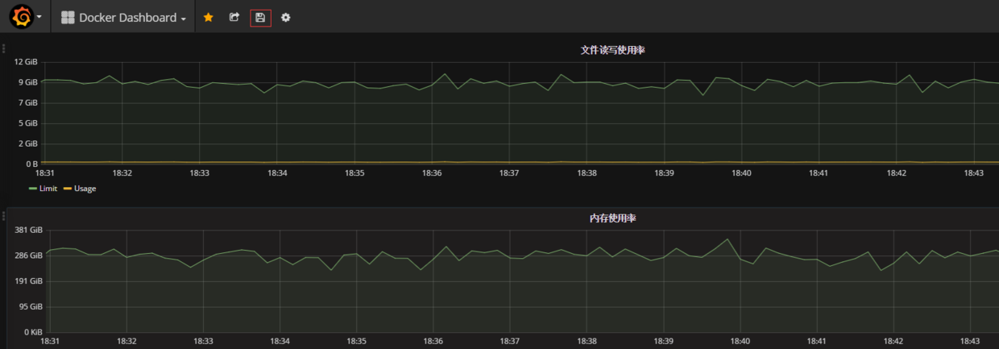
   至此， 所有配置步骤完成， 我们能够看到Grafana显示相关的监控图表信息。