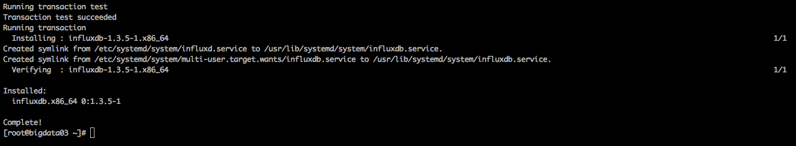
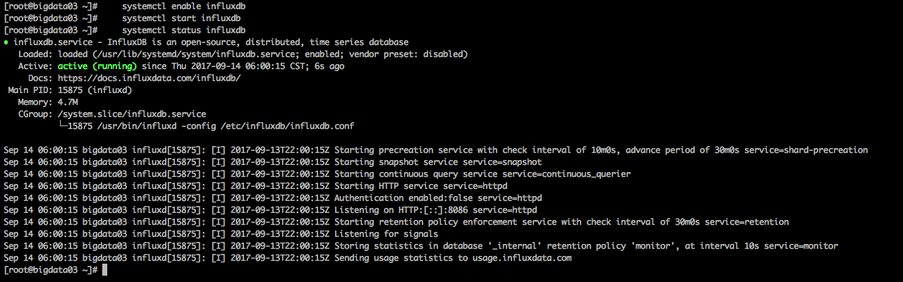

http://blog.csdn.net/qq_21398167/article/details/52920288
1.配置yum源
cat <<EOF | sudo tee /etc/yum.repos.d/influxdb.repo
[influxdb]
name = InfluxDB Repository - RHEL \$releasever
baseurl = https://repos.influxdata.com/rhel/\$releasever/\$basearch/stable
enabled = 1
gpgcheck = 1
gpgkey = https://repos.influxdata.com/influxdb.key
EOF

2.安装influxdb
    yum install -y  influxdb
   

3.启动influxdb
    systemctl enable influxdb
    systemctl start influxdb

4.检查启动情况
    systemctl status influxdb
    

5.查看端口
    netstat -luntp
    

6.进入influxDB
   influx
   

7.创建&查看用户
    CREATE USER "ptquery" WITH PASSWORD 'ptquery'
    SHOW USERS;
9.创建root用户
    CREATE USER "root" WITH PASSWORD 'root' WITH ALL PRIVILEGES;
    SHOW USERS;
    
8.创建&查看数据库
    CREATE DATABASE testdb
    SHOW DATABASES;
    
9.进入数据库
    USE testdb;
10.插入一条测试数据
    INSERT cpu,host=test,region=us_west value=0.64
    SELECT * FROM /.*/ LIMIT 1

11.服务默认使用端口：
    Networking By default, InfluxDB uses the following network ports:
    TCP port 8083 is used for InfluxDB’s Admin panel
    TCP port 8086 is used for client-server communication over InfluxDB’s HTTP API
    TCP ports 8088 and 8091 are required for clustered InfluxDB instances
-------------------------
-------------------------
-------------------------

1.查询配置文件位置
    rpm -qc influxdb    
    

6.编辑配置文件
    修改InfluxDB的配置，主要配置jmeter存储的数据库与端口号，还有需要将UI端口开放
    命令
    vim /etc/influxdb/influxdb.conf
    步骤：
    
    #修改 bind-address
     bind-address = "10.100.134.3:8088"

    # 找到graphite并且修改它的库与端口
    [[graphite]]
      enabled = true
      database = "jmeter"
      bind-address = ":2003"
      protocol = "tcp"
      consistency-level = "one"
      
    # 找到admin，将前面的#号去掉，开放它的UI端口
    [admin]
      # Determines whether the admin service is enabled.
      enabled = true
    
      # The default bind address used by the admin service.
      bind-address = ":8083"
    
      # Whether the admin service should use HTTPS.
      # https-enabled = false
    
      # The SSL certificate used when HTTPS is enabled.
      # https-certificate = "/etc/ssl/influxdb.pem
    重启：
        systemctl restart influxdb
        systemctl status influxdb
        netstat -luntp

        systemctl stop influxdb

