http://time-track.cn/kubernetes-resource-usage-monitor-practice.html

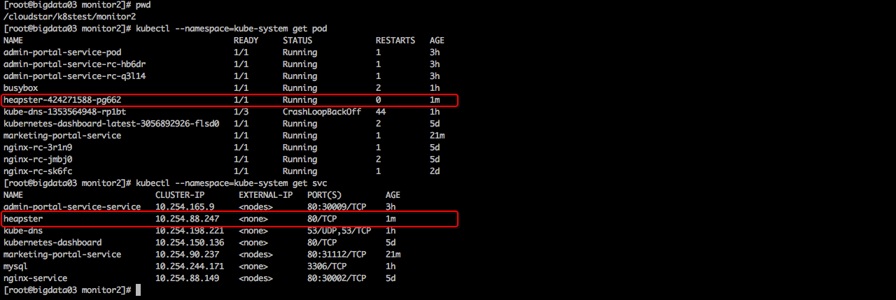

##############################################
一、测试cAdvisor
cAdvisor工具已经集成到了kubelet文件中默认监听在4194端口，
如果当前的kubenetes集群是启动状态，如下链接可以获得单个节点的监控容器信息。

http://bigdata03:4194
http://bigdata04:4194
http://bigdata05:4194
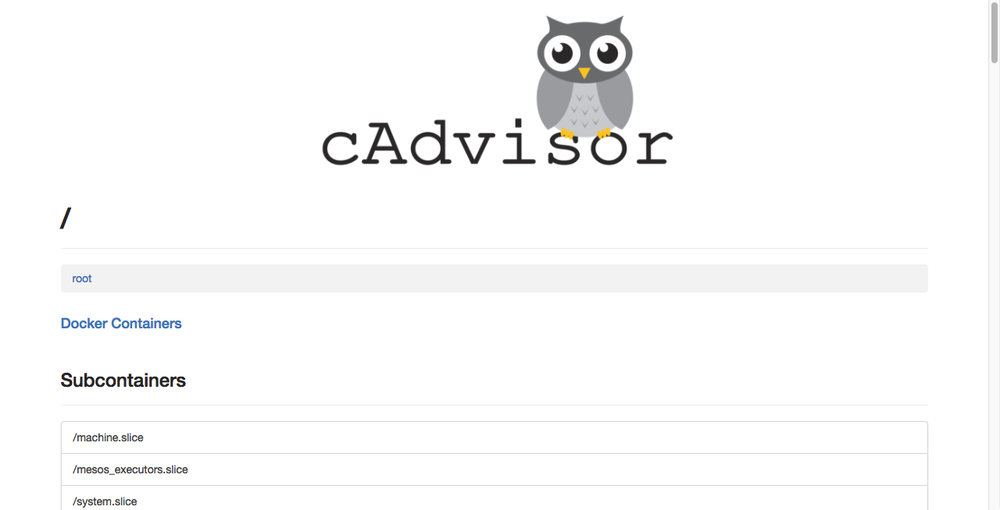
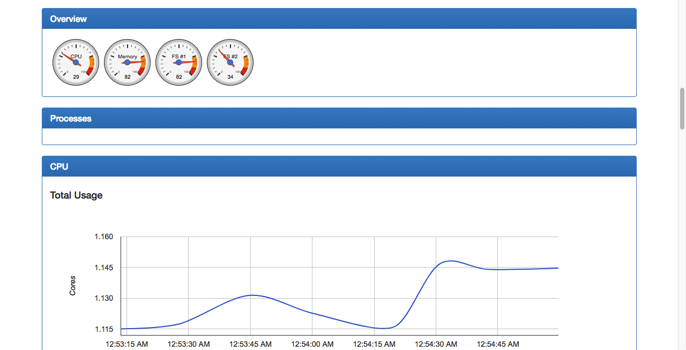

Heapster和普通的应用一样，都是以Pod的方式运行在集群中，并通过kubelet进程获取Node的使用信息，
而kubelet则是通过自己内置的cAdvisor来获取数据。然后Heapster根据Pod及相关的Labels将这些信息
进行分组聚合，最后保存到后端。这个后端也是可配置的，在开源界最受欢迎的是InfluxDB(使用Grafana作
为前端展示)，其他支持的后端可参考here。整个监控的架构如下：

##############################################
一、部署heapster
部署heapster
    kubectl create -f heapster-deployment.yaml
    kubectl create -f heapster-service.yaml
    
    kubectl delete -f heapster-deployment.yaml
    kubectl delete -f heapster-service.yaml
查看heapster，命令行
    kubectl --namespace=kube-system get pod
    kubectl --namespace=kube-system get svc
    

查看heapster，浏览器
    服务中有heapster
    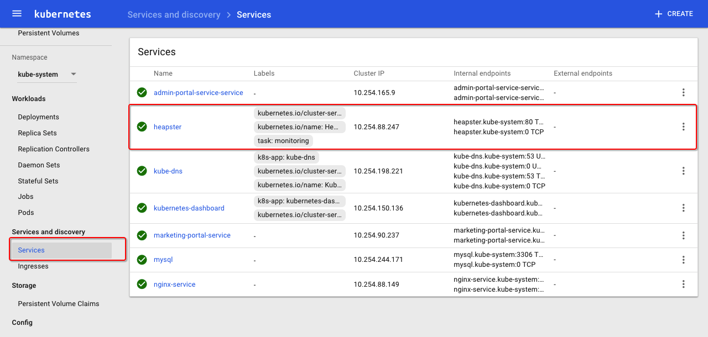
    ui的统计信息可以显示
    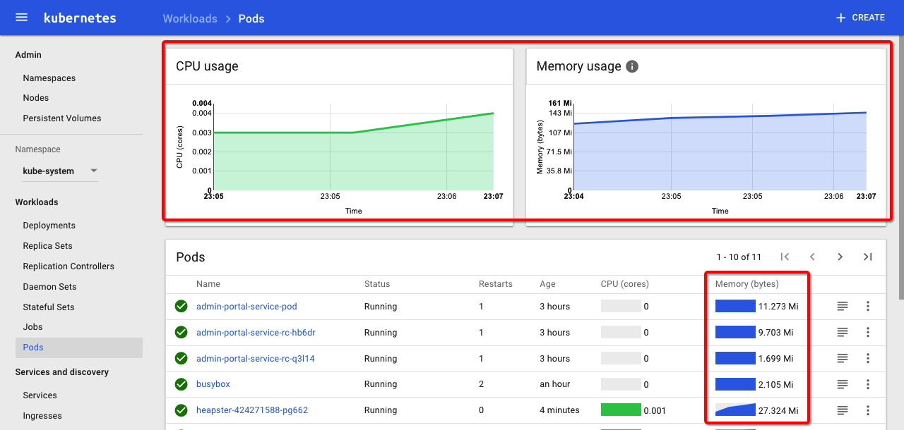

##############################################
二、部署influxdb
部署influxdb
    kubectl create -f influxdb-deployment.yaml
    kubectl create -f influxdb-service.yaml
    
    kubectl delete -f influxdb-deployment.yaml
    kubectl delete -f influxdb-service.yaml
查看influxdb，命令行
    kubectl --namespace=kube-system get pod
    kubectl --namespace=kube-system get svc
    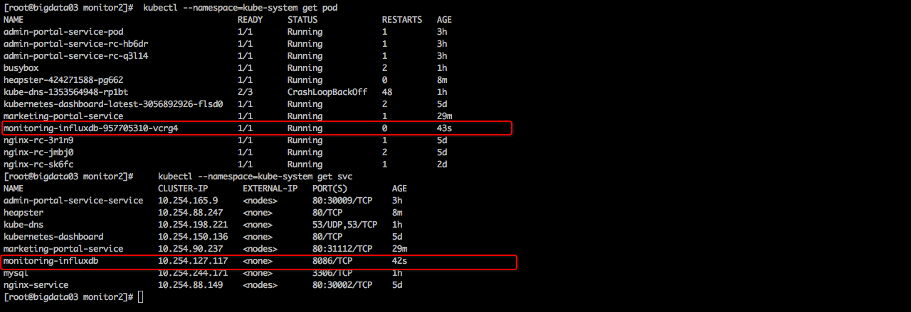
通过kube-dns查看
    kubectl exec busybox -c busybox -- nslookup monitoring-influxdb
    

查看influxdb，浏览器
    服务中有influxdb
    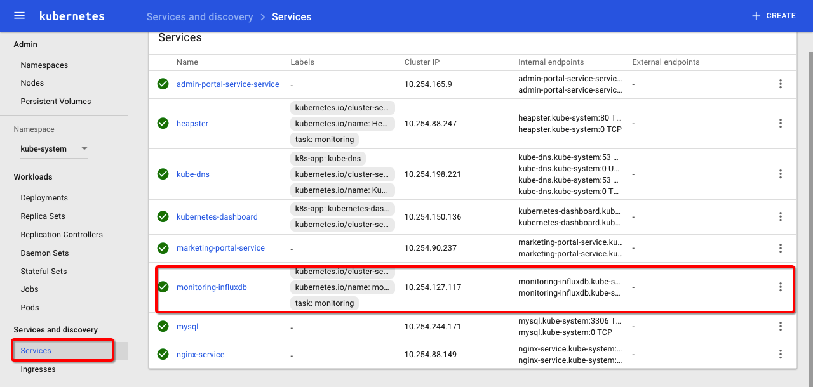
    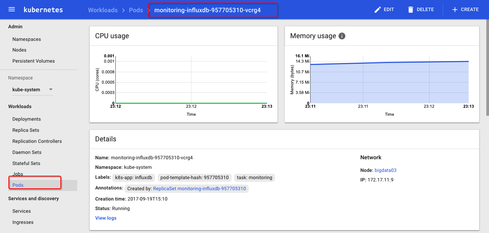

登陆InfluxDB
InfluxDB默认的端口是8086，用户名和密码都是"root"。
当你登录到Grafana后，可以通过http://monitoring-influxdb:8086来访问InfluxDB。

##############################################
二、部署grafana
部署grafana
    kubectl create -f grafana-deployment.yaml
    kubectl create -f grafana-service.yaml
    
    kubectl delete -f grafana-deployment.yaml
    kubectl delete -f grafana-service.yaml
查看grafana，命令行
    kubectl --namespace=kube-system get pod
    kubectl --namespace=kube-system get svc
    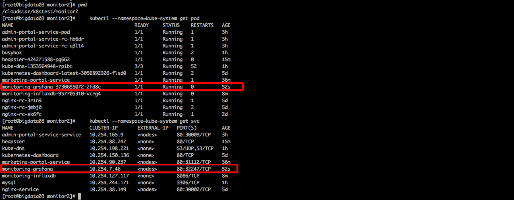

查看grafana，浏览器
    服务中有grafana
    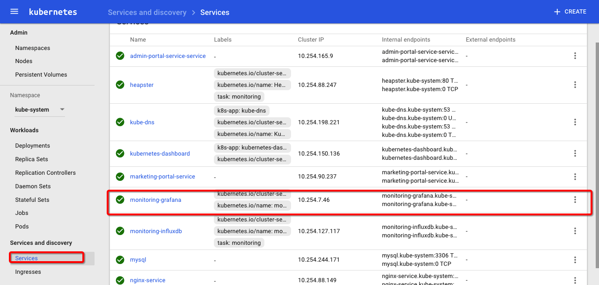
打开grafana的ui
    查看端口
    kubectl --namespace=kube-system get svc
    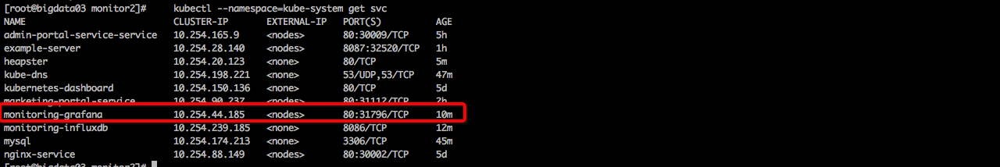
    访问grafana
    http://bigdata03:31351
    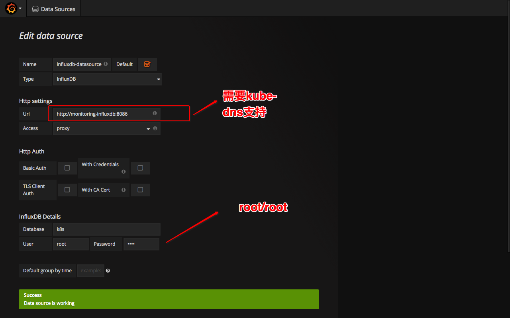
    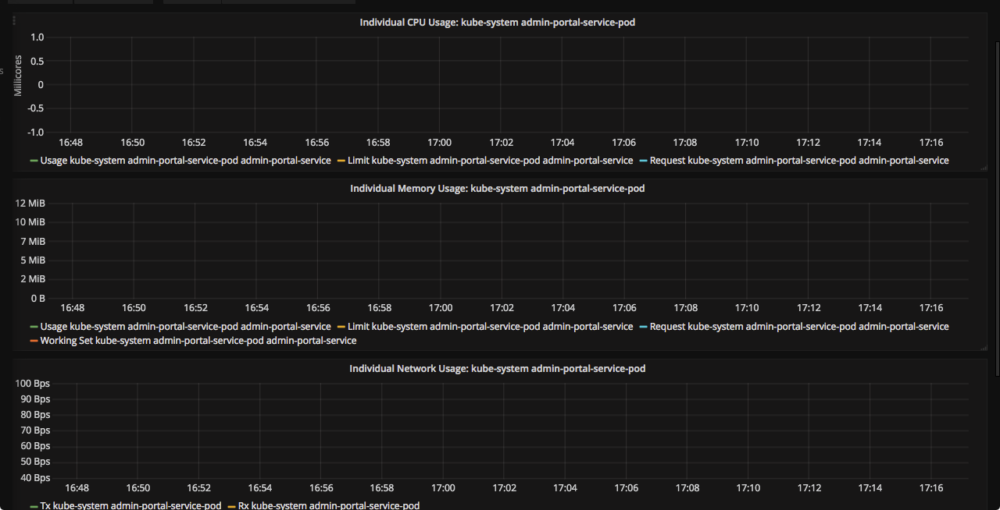

