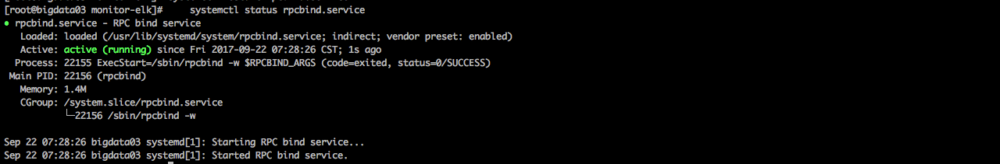
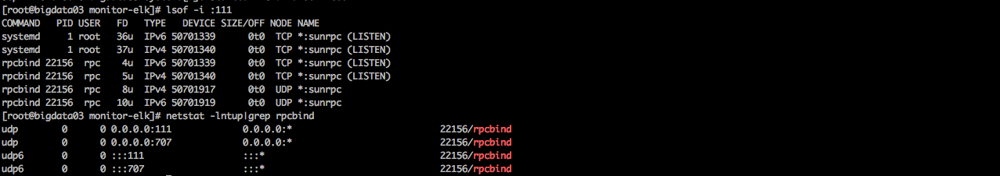
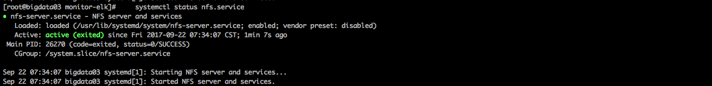
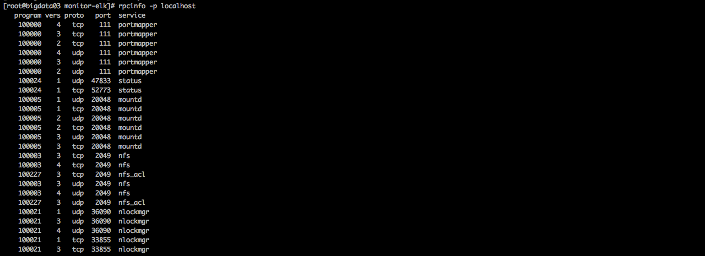
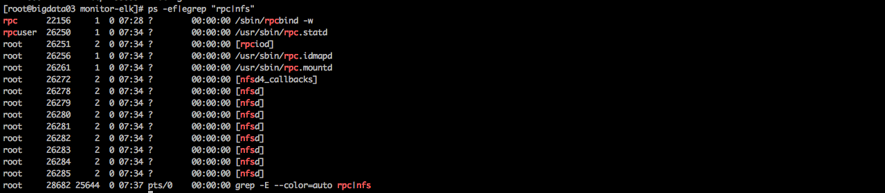
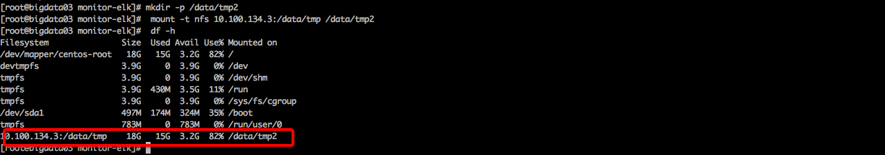

http://www.cnblogs.com/jkko123/p/6361476.html?utm_source=itdadao&utm_medium=referral
1.安装 nfs-utils、rpcbind
	yum install -y nfs-utils rpcbind

2.启动rpcbind服务
    systemctl restart rpcbind.service
    systemctl enable rpcbind.service


3.验证rpcbind服务
    systemctl status rpcbind.service
    
4.查看端口   
    lsof -i :111
    netstat -lntup|grep rpcbind
    
    
5.查看nfs服务向rpc注册的端口信息
    rpcinfo -p localhost   
    
    
    
6.启动NFS服务
    systemctl start nfs.service    
    systemctl enable nfs.service    

7.查看NFS服务
    systemctl status nfs.service   
    

8.再次查看rpc注册的端口信息
    rpcinfo -p localhost
    
9.查看进程
    ps -ef|egrep "rpc|nfs"   
    
        
    ```
        nfsd(rpc.nfsd)主进程，主要是管理客户端能否登入服务端，登入者ID判别。
        mountd(rpc.mountd)管理NFS文件系统，登入者的权限管理
        rpc.lockd(非必要)用来锁定文件，用于客户端同时写入
        rpc.statd(非必要)检查文件一致性
        rpc.idmapd 名字映射后台进程
    ```

10.NFS服务端配置   
    echo "/data/tmp 10.100.134.0/24(rw,sync,all_squash)" > /etc/exports
11.创建需要共享的目录
    mkdir -p /data/tmp
    chown nfsnobody.nfsnobody /data/tmp  
    
12.重新加载nfs配置
    exportfs -rv
    

13.查看nfs服务器挂载情况
    showmount -e  10.100.134.3
    showmount -e localhost   
    
    
14.挂载测试
    挂载目录
        mkdir -p /data/tmp2
        mount -t nfs 10.100.134.3:/data/tmp /data/tmp2
    查看挂载
        df -h
        
    在tmp下创建文件
        touch /data/tmp/1.txt
    查看tmp2下是否有文件
        ls /data/tmp2
        

15.卸载挂载
    umount /data/tmp2


    
    
    
    
    
    
    
    
    
    
    
