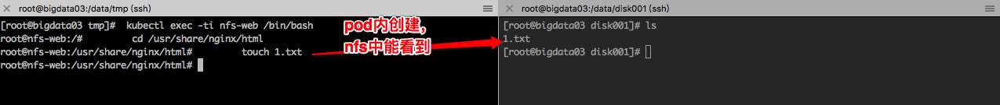
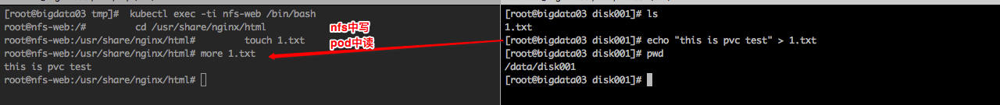

http://www.cnblogs.com/zhenyuyaodidiao/p/6626023.html

Persistent Volume（持久卷）和Persistent Volume Claim（持久卷消费者）
```
一、简介
　　存储管理与计算管理是两个不同的问题。Persistent Volume子系统，对存储的供应和使用做了抽象，以API形式提供给管理员和用户使用。要完成这一任务，我们引入了两个新的API资源：Persistent Volume（持久卷）
    和Persistent Volume Claim（持久卷消费者）。

　　Persistent Volume（PV）是集群之中的一块网络存储。跟Node一样，也是集群的资源。PV跟Volume(卷)类似，不过会有独立于Pod的生命周期。这一API对象包含了存储的实现细节，例如NFS、iSCSI或者其他的云提
   供商的存储系统。Persistent Volume Claim(PVC)是用户的一个请求。跟Pod类似，Pod消费Node的资源，PVC消费PV的资源。Pod能够申请特定的资源（CPU和内存）；Claim能够请求特定的尺寸和访问模式（例如可以加载一个读写，以及多个只读实例）。
二、PV和PVC的生命周期
　　PV是集群的资源。PVC是对这一资源的请求，也是对资源的所有权的检验。PV和PVC之间的互动遵循如下的生命周期。

2.1 供应

　　集群管理员会创建一系列的PV。这些PV包含了为集群用户提供的真实存储资源，它们可利用KubernetesAPI来消费。

2.2 绑定

　　用户创建一个包含了容量和访问模式的持久卷申请。Master会监听PVC的产生，并尝试根据请求内容查找匹配的PV，并把PV和PVC进行绑定。用户能够获取满足需要的资源，并且在使用过程中可能超出请求数量。

　　如果找不到合适的卷，这一申请就会持续处于非绑定状态，一直到出现合适的PV。例如一个集群准备了很多的50G大小的持久卷，（虽然总量足够）也是无法响应100G的申请的，除非把100G的PV加入集群。

2.3 使用

　　Pod把申请作为卷来使用。集群会通过PVC查找绑定的PV，并Mount给Pod。对于支持多种访问方式的卷，用户在使用PVC作为卷的时候，可以指定需要的访问方式。

一旦用户拥有了一个已经绑定的PVC，被绑定的PV就归该用户所有了。用户的Pods能够通过在Pod的卷中包含的PVC来访问他们占有的PV。

2.4 释放

　　当用户完成对卷的使用时，就可以利用API删除PVC对象了，而且他还可以重新申请。删除PVC后，对应的卷被视为“被释放”，但是这时还不能给其他的PVC使用。之前的PVC数据还保存在卷中，要根据策略来进行后续处理。

2.5 回收

　　PV的回收策略向集群阐述了在PVC释放卷的时候，应如何进行后续工作。目前可以采用三种策略：保留，回收或者删除。保留策略允许重新申请这一资源。在持久卷能够支持的情况下，删除策略会同时删除持久卷以及AWS EBS/GCE PD或者Cinder卷中的存储内容。如果插件能够支持，回收策略会执行基础的擦除操作（rm -rf /thevolume/*），这一卷就能被重新申请了。

三、持久卷PV
3.1 持久卷的类型
　　 持久卷是以插件方式实现的，目前支持如下插件：
    GCEPersistentDisk
    AWSElasticBlockStore
    NFS
    iSCSI
    RBD (Ceph Block Device)
    Glusterfs
    HostPath (单节点测试使用)
    持久卷

```

0.挂载磁盘
    echo "/data/disk001 10.100.134.0/24(rw,sync,all_squash)" >> /etc/exports
    exportfs -rv
    mkdir -p /data/disk001
    chown nfsnobody.nfsnobody /data/disk001
    mkdir -p /cloudstar/data/disk001
    mount -t nfs 10.100.134.3:/data/disk001 /cloudstar/data/disk001

    NFS路径：/data/disk001
    本地路径：/cloudstar/data/disk001

1.持久卷定义
    *[](yml/nfs-pv1.yaml)
    创建命令
        kubectl create -f nfs-pvc1.yaml
    查看命令
        kubectl get pods
2.PersistentVolumeClaims（持久卷消费者）
    *[](yml/nfs-pvc1.yaml)
    创建命令
         kubectl create -f nfs-pvc1.yaml
    查看命令
        kubectl get pods

3. 使用PVC卷
　　Pod能够借助PVC来访问存储。PVC必须跟Pod处于同一个命名空间。集群找到Pod命名空间中的PVC，
    然后利用PVC获取到背后的PV。这个卷就会被加载到主机上，让Pod可以使用。
    *[](yml/nfs-web.yaml)
    创建命令
        kubectl create -f nfs-web.yaml
4. pod内测试PVC卷挂载情况        
    进入pod
        kubectl exec -ti nfs-web /bin/bash
        cd /usr/share/nginx/html
        touch 1.txt
    在NFS挂载的目录中能够看到该文件    
    
4. NFS中测试PVC卷挂载情况  
    在nfs中写入字符
        cd /data/disk001
        echo "this is pvc test" > 1.txt
    进入pod能读出字符
        kubectl exec -ti nfs-web /bin/bash
        cd /usr/share/nginx/html
        more 1.txt
    

