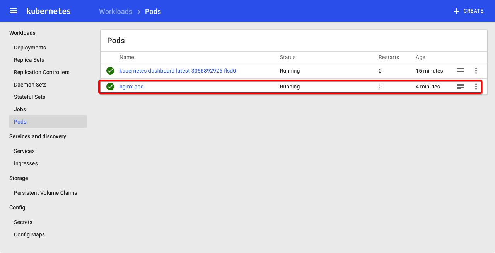
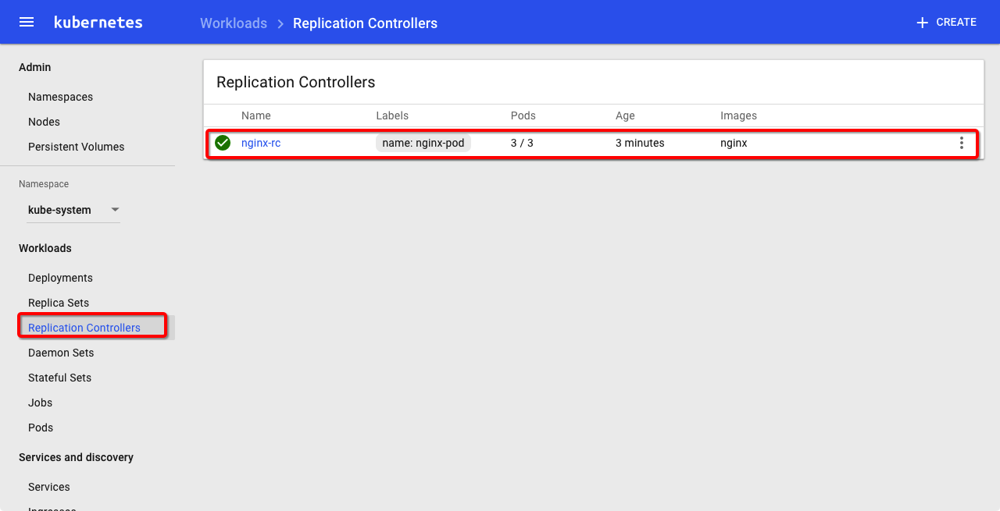
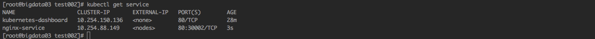
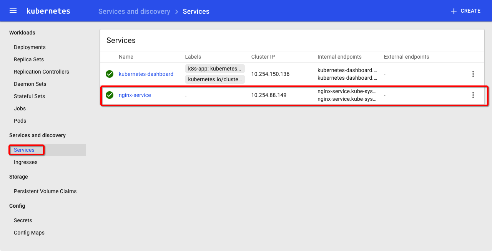
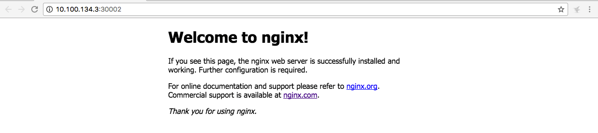

参考
http://blog.csdn.net/u013760355/article/details/68061976

0.进入配置文件目录
cd /cloudstar/k8stest/test002
1.创建pod : nginx-pod.yaml
kubectl create -f nginx-pod.yaml
2.查看pod的状态
    kubectl get pods 
    
    开始状态
    NAME                                           READY     STATUS              RESTARTS   AGE
    nginx-pod                                      0/1       ContainerCreating   0          8s
    而后状态
    nginx-pod                                      1/1       Running   0          3m
  
   

    PS：这里经常会因为网络问题失败，可以先使用docker手动pull镜像后再使用kubectl来create pod
    ，如果还是不行，就delete pod之后再create pod，实在不行，可以重启机器试试，还是不行，那就是配置出问题了

3.创建replicationController : nginx-rc.yaml
    kubectl create -f nginx-rc.yaml

4.查看RC的状态
    kubectl get rc
    
    

5.创建service : nginx-service.yaml
    kubectl create -f nginx-service.yaml
6.查看service状态
   kubectl get services
   
   

7.测试发布的nginx服务
    http://10.100.134.3:30002
    

 
 
 
 
 
 
 
