###官方网站  
```
官方网站
    https://kubernetes.io
中文社区
    https://www.kubernetes.org.cn
    
```
###概述  


```
Google的实力不用介绍。
```

```
Kubernetes这个名字源自希腊语，意思是“舵手”，也是“管理者”，“治理者”等词的源头。
k8s是Kubernetes的简称（用数字『8』替代中间的8个字母『ubernete』）。
主要功能如下：
    1) 使用Docker对应用程序包装(package)、实例化(instantiate)、运行(run)。
    2) 以集群的方式运行、管理跨机器的容器。
    3) 解决Docker跨机器容器之间的通讯问题。
    4) Kubernetes的自我修复机制使得容器集群总是运行在用户期望的状态。
特点如下：
    简洁的：轻量级，简单，易上手
    可移植的：公有，私有，混合，多重云（multi-cloud）
    可扩展的: 模块化, 插件化, 可挂载, 可组合
    可自愈的: 自动布置, 自动重启, 自动复制

```
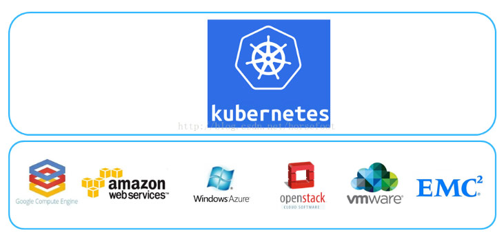
```
适用于多种集成平台.当前Kubernetes支持GCE、vShpere、
CoreOS、OpenShift、Azure等平台，除此之外，也可以直接运行在物理机上
```
###架构
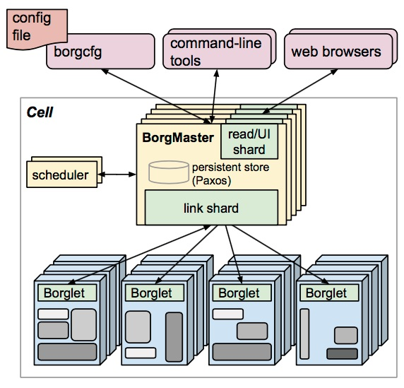
```
Borg主要由BorgMaster、Borglet、borgcfg和Scheduler组成

BorgMaster是整个集群的大脑，负责维护整个集群的状态，并将数据持久化到 Paxos存储中; 
Scheduer负责任务的调度，根据应用的特点将其调度到具体的机器上去; 
Borglet负责真正运行任务(在容器中); 
borgCLI是Borg的命令行工具，用于跟Borg系统交互，一般通过一个配置文件 来提交任务。
borgcfg配置管理工具，管理集群中的配置文件和配置信息。
```


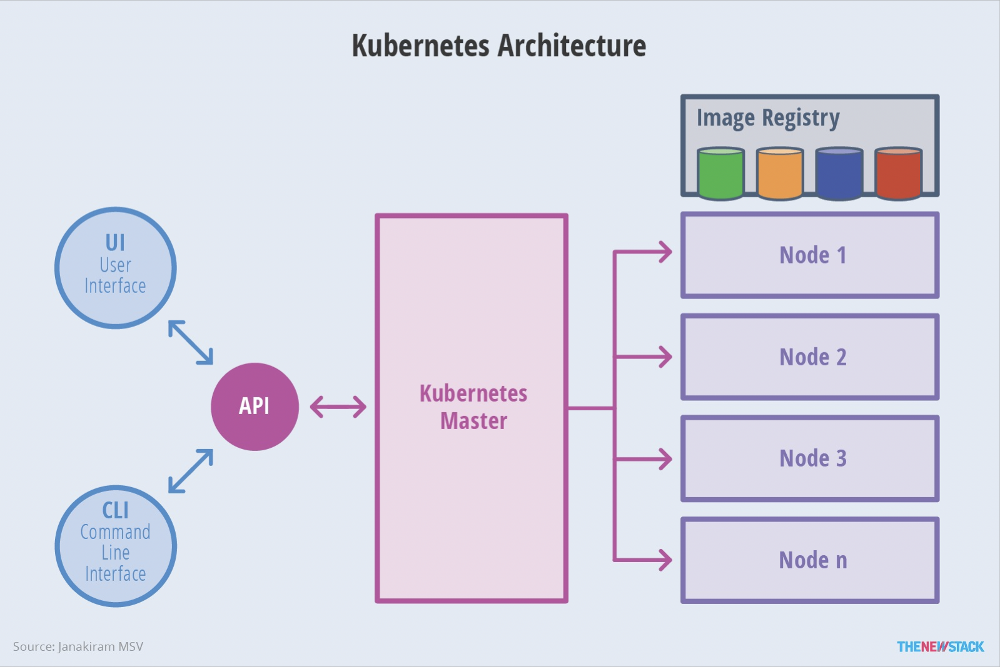
```
1.主从设计：master和node
2.方便交互：ui和cli都要支持，统一有API处理
3.与container技术融合，提供image storage的支持
```
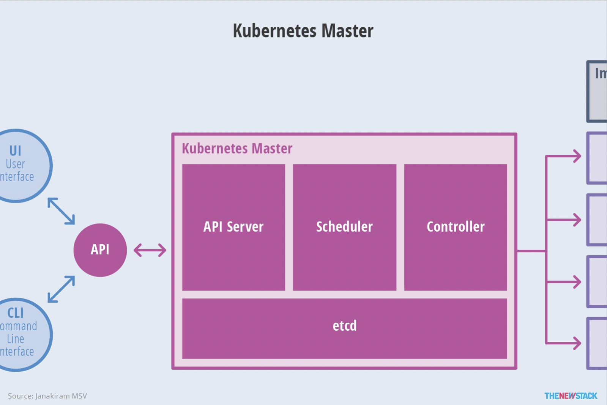
```
主要四个部分
    1.etcd存储集群状态
    2.aipserver提供API交互
    3.scheduler提供：集群的资源调度
    3.controller提供：负责执行各种控制器
```
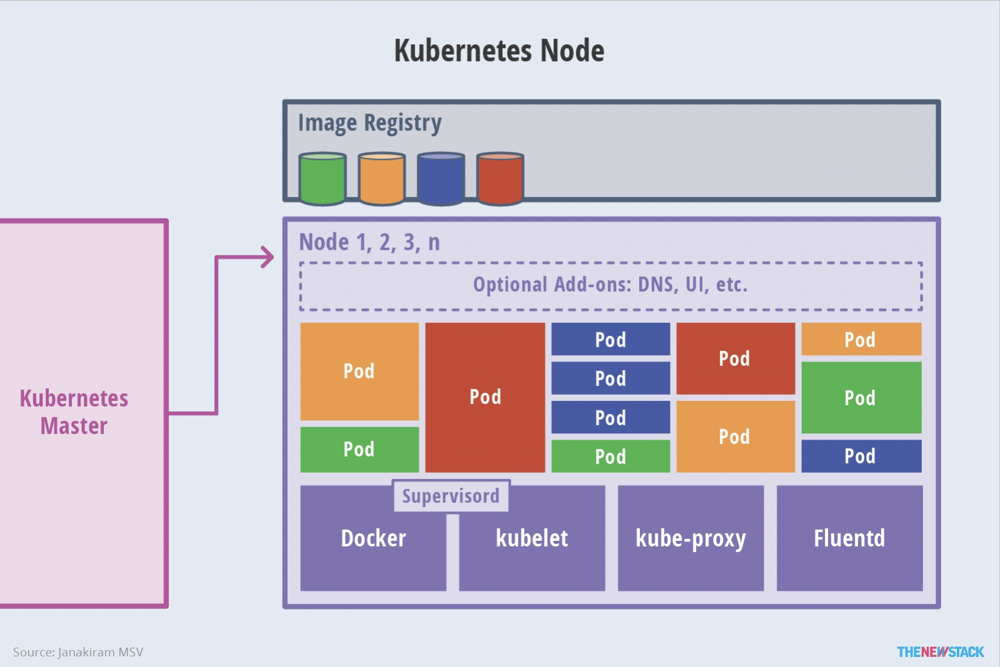
```
主要三个部件：
    1.docker引擎：提供与container技术融合的基础。
    2.kubelet:负责管控docker容器，如启动/停止、监控运行状态等。
    3.kube-proxy:负责为pod提供代理。它会定期从etcd获取所有的service，并根据service信息创建代理。
```

```
master运行四个组件：
    1.etcd保存了整个集群的状态;
    2.apiserver：作为kubernetes系统的入口，封装了核心对象的增删改查操作，以RESTFul接口方式提供给外部客户
                和内部组件调用。它维护的REST对象将持久化到etcd（一个分布式强一致性的key/value存储）。
    3.scheduler：负责集群的资源调度，为新建的pod分配机器。这部分工作分出来变成一个组件，意味着可以很方便地替
                换成其他的调度器。
    4.controller-manager：负责执行各种控制器，目前有两类：
        ◦endpoint-controller：定期关联service和pod(关联信息由endpoint对象维护)，保证service到pod的
                              映射总是最新的。
        ◦replication-controller：定期关联replicationController和pod，保证replicationController定
                                义的复制数量 与实际运行pod的数量总是一致的。

node(称作minion)运行三个组件：
    1.kubelet：负责管控docker容器，如启动/停止、监控运行状态等。它会定期从etcd获取分配到本机的pod，并根据pod
              信息 启动或停止相应的容器。同时，它也会接收apiserver的HTTP请求，汇报pod的运行状态。内部已经集成
              cadvisor,可以提供容器的监控。
    2.proxy：负责为pod提供代理。它会定期从etcd获取所有的service，并根据service信息创建代理。当某个客户pod要
              访问其他pod时，访问请求会经过本机proxy做转发。

    3.容器引擎
其他组件
    kube-dns负责为整个集群提供DNS服务
    Ingress Controller为服务提供外网入口 
    Heapster提供资源监控 
    Dashboard提供GUI 
    Federation提供跨可用区的集群              
```
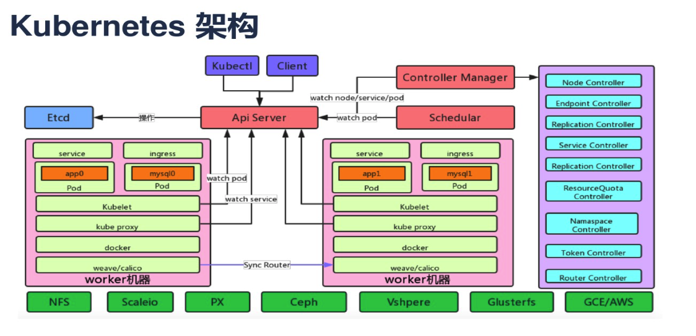

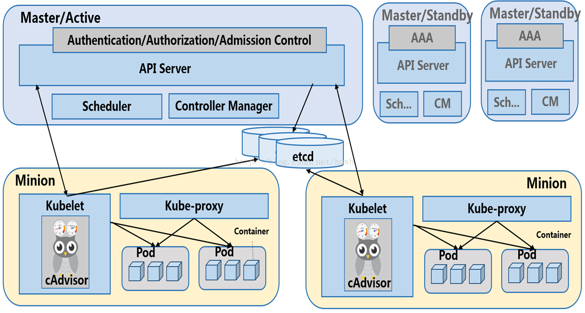
```

```
###Federation架构
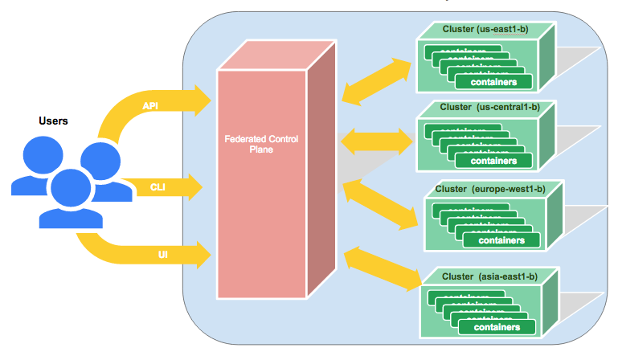
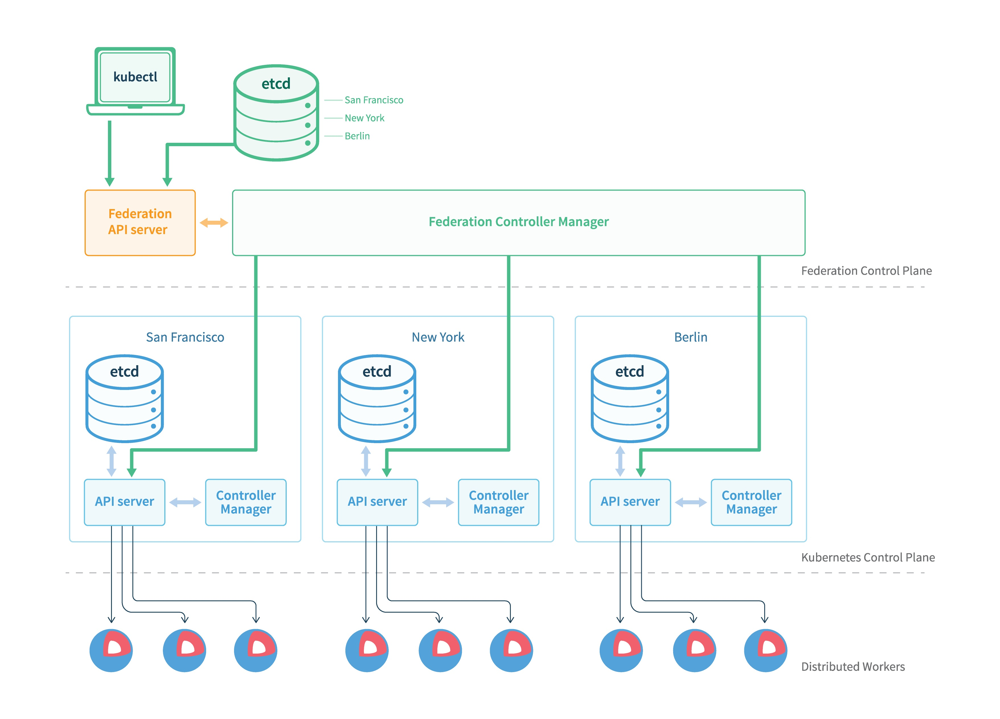


###Flannel网络
```
为什么使用flannel（why）

在默认的Docker配置中，每个节点上的Docker服务会分别负责所在节点容器的IP分配。这样导致的一个问题是，不同节点上容器
可能获得相同的内外IP地址。Flannel的设计目的就是为集群中的所有节点重新规划IP地址的使用规则，从而使得不同节点上的容
器能够获得“同属一个内网”且”不重复的”IP地址，并让属于不同节点上的容器能够直接通过内网IP通信。
```

```
    1.数据从源容器中发出后，经由所在主机的docker0虚拟网卡转发到flannel0虚拟网卡，这是个P2P的虚拟网卡，flanneld服务监
      听在网卡的另外一端。
    2.Flannel通过Etcd服务维护了一张节点间的路由表。
    3.源主机的flanneld服务将原本的数据内容UDP封装后根据自己的路由表投递给目的节点的flanneld服务，数据到达以后被解包，然
      后直 接进入目的节点的flannel0虚拟网卡，然后被转发到目的主机的docker0虚拟网卡，最后就像本机容器通信一下的有docker0
      路由到达目标容 器。
```
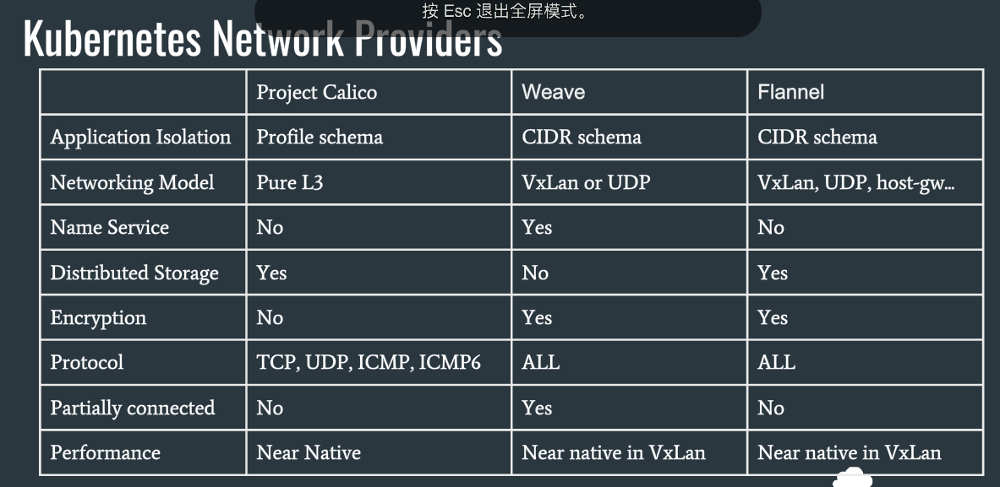


##扩展部分的连接：
http://blog.csdn.net/huwh_/article/details/71308171
https://yq.aliyun.com/articles/47308?spm=5176.100240.searchblog.19.jF7FFa
###master工作流程
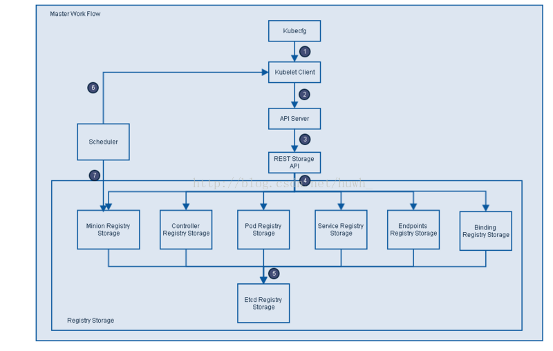
```
1.Kubecfg将特定的请求，比如创建Pod，发送给Kubernetes Client。
2.Kubernetes Client将请求发送给API server。
3.API Server根据请求的类型，比如创建Pod时storage类型是pods，然后依此选择何种REST Storage API对请求作出处理。
4.REST Storage API对的请求作相应的处理。
5.将处理的结果存入高可用键值存储系统Etcd中。
6.在API Server响应Kubecfg的请求后，Scheduler会根据Kubernetes Client获取集群中运行Pod及Minion/Node信息。
7.依据从Kubernetes Client获取的信息，Scheduler将未分发的Pod分发到可用的Minion/Node节点上。
```
###API Server工作流程
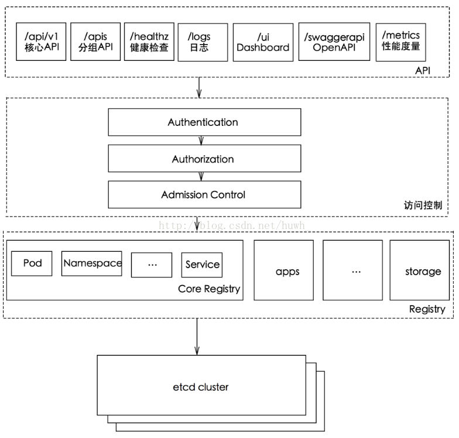
```
提供了资源对象的唯一操作入口，其他所有组件都必须通过它提供的API来操作资源数据，只有API Server与存储通信，其他模块通过API Server
访问集群状态。
    第一，是为了保证集群状态访问的安全。
    第二，是为了隔离集群状态访问的方式和后端存储实现的方式：API Server是状态访问的方式，不会因为后端存储技术etcd的改变而改变。
    作为kubernetes系统的入口，封装了核心对象的增删改查操作，以RESTFul接口方式提供给外部客户和内部组件调用。对相关的资源数据
    “全量查询”+“变化监听”，实时完成相关的业务功能。
```


###Controller Manager工作流程

```
实现集群故障检测和恢复的自动化工作，负责执行各种控制器，主要有：
    endpoint-controller：定期关联service和pod(关联信息由endpoint对象维护)，保证service到pod的映射总是最新的。
    replication-controller：定期关联replicationController和pod，保证replicationController定义的复制数量与
    实际运行pod的数量总是一致的。
```

###kuberlet工作流程

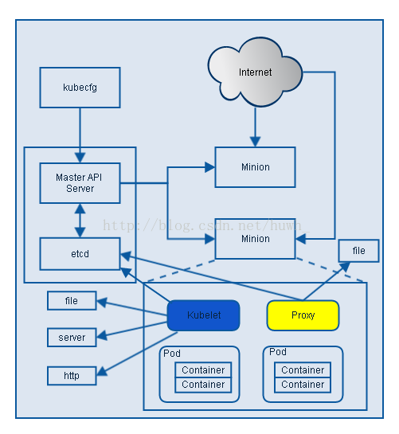
```
负责Node节点上pod的创建、修改、监控、删除等全生命周期的管理 定时上报本Node的状态信息给API Server。
kubelet是Master API Server和Minion之间的桥梁，接收Master API Server分配给它的commands和work，
与持久性键值存储etcd、file、server和http进行交互，读取配置信息。
具体的工作如下：
    1.设置容器的环境变量、给容器绑定Volume、给容器绑定Port、根据指定的Pod运行一个单一容器、给指定的Pod创建network 容器。
    2.同步Pod的状态、同步Pod的状态、从cAdvisor获取container info、 pod info、 root info、 machine info。
    3.在容器中运行命令、杀死容器、删除Pod的所有容器。
```


http://blog.csdn.net/huwh_/article/details/77017281
https://www.kubernetes.org.cn/2059.html