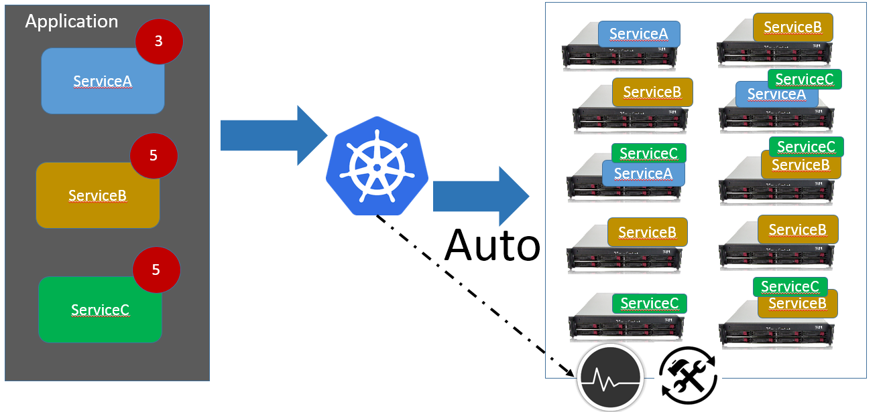

！！！！！！！



```

```


| 服务发现方案     | Pros                                     | Cons                                     |
| :--------- | ---------------------------------------- | ---------------------------------------- |
| Eureka     | 使用简单，适用于java语言开发的项目，比服务端服务发现少一次网络跳转      | 对非Java语言的支持不够好，Consumer需要内置特定的服务发现客户端和发现逻辑 |
| Kubernetes | Consumer无需关注服务发现具体细节，只需知道服务的DNS域名即可，支持异构语言开发 | 需要基础设施支撑，多了一次网络跳转，可能有性能损失                |

```
这两种架构都各有利弊，我们拿客户端服务发现软件Eureka和服务端服务发现架构Kubernetes/SkyDNS+Ingress LB+Traefik+PowerDNS为例说明。

**Eureka** 也不是单独使用的，一般会配合 ribbon 一起使用，ribbon 作为路由和负载均衡。

**Ribbon**提供一组丰富的功能集：

- 多种内建的负载均衡规则：
  - Round-robin 轮询负载均衡
  - 平均加权响应时间负载均衡
  - 随机负载均衡
  - 可用性过滤负载均衡（避免跳闸线路和高并发链接数）
  - 自定义负载均衡插件系统
- 与服务发现解决方案的可拔插集成（包括Eureka）
- 云原生智能，例如可用区亲和性和不健康区规避
- 内建的故障恢复能力
```


http://omerio.com/2015/12/18/learn-the-kubernetes-key-concepts-in-10-minutes/